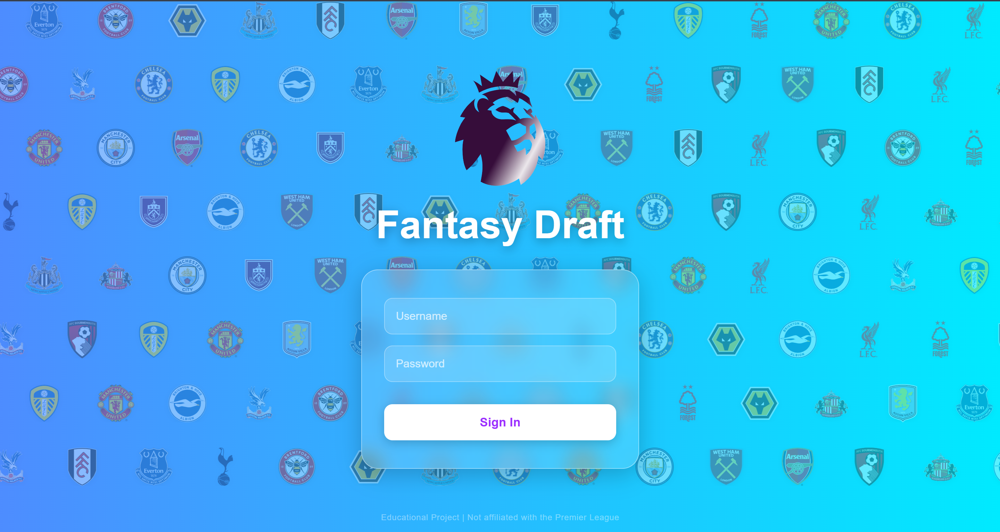
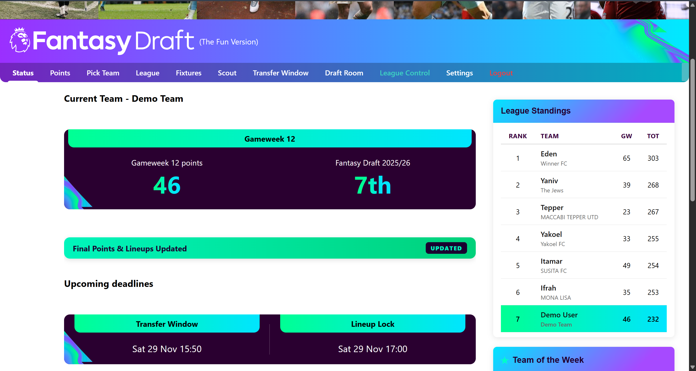
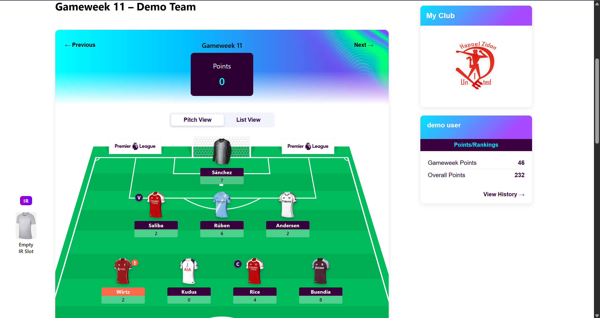
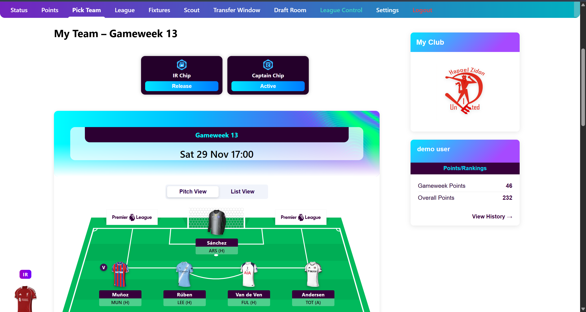
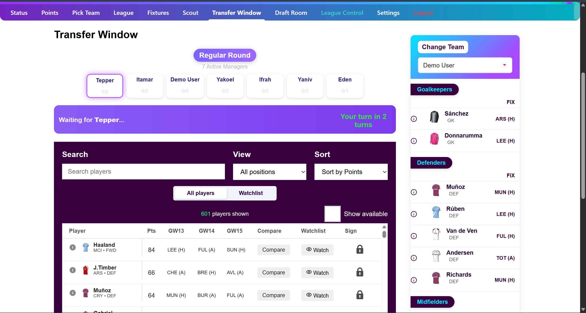
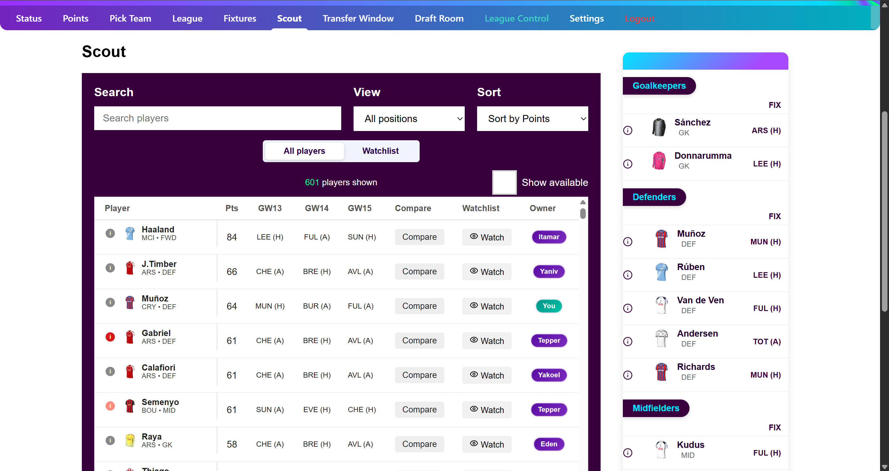
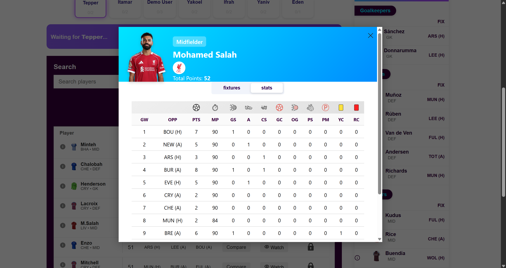
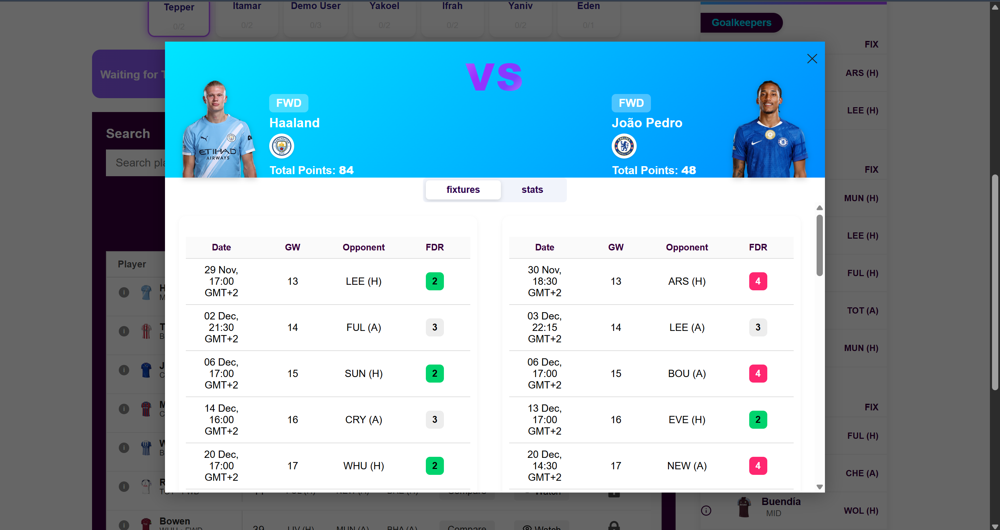

# Premier League Fantasy Draft


A full-stack, real-time Fantasy Football application where users draft Premier League players, manage their squads, and compete based on real-world player performance.

This is a **Portfolio Project** built by a Software Engineering student, demonstrating complex full-stack synchronization using **WebSockets**, **Optimistic UI**, and **Concurrent Scheduling**.

---

## Live Demo

This application is deployed and ready to use.

- **Frontend Application:** [Link to Vercel App](https://fantasy-draft-sigma.vercel.app)
- **Backend API:** [Link to Render App](https://your-api.onrender.com)

> **Important:** The backend is hosted on a free instance on Render. It may take **approx. 50-60 seconds** to wake up upon the first request. Please be patient if the initial login takes a moment.

### Demo Credentials
Use these credentials to log in and explore the system immediately without registering:

| Role | Username | Password |
| :--- | :--- | :--- |
| **User** | `demo` | `123456` |

---

## Legal Disclaimer & Fair Use

This project is a **personal, non-commercial, educational application** created solely for learning software engineering technologies and demonstrating technical skills.

1.  **Non-Commercial:** This application is free to use and generates no revenue.
2.  **Fair Use:** The use of Premier League team logos and player data falls under "Fair Use" principles for educational purposes.
3.  **Ownership:** All trademarks (including "Premier League", "FPL", and club crests) belong to their respective owners. This project is **not** affiliated with the Premier League.

---

## Game Rules & Mechanics

Unlike standard Fantasy Football, this application implements a **Draft Model** with unique ownership constraints and complex squad management rules.

### 1. The Season Draft
* **Unique Ownership:** Each Premier League player can belong to only **one** user in the league.
* **Snake Draft Logic:** Users draft in a specific order (1 to N, then N to 1) to ensure fairness.
* **Squad Constraints:** Each manager must draft exactly 15 players:
    * 2 Goalkeepers
    * 5 Defenders
    * 5 Midfielders
    * 3 Forwards

### 2. Squad Management
* **Starting XI:** Managers must select 11 starters each week based on valid football formations (e.g., 4-4-2, 3-5-2).
* **Scoring System:** Points are awarded based on real-world individual performance (goals, assists, clean sheets, saves, etc.).
* **Detailed Stats:** The system provides full data on every player, including injury status (news) and historical performance.

### 3. Waiver Wire & Transfers
* **Weekly Windows:** A transfer window opens automatically every week.
* **Waiver Logic:** Users can submit up to 2 transfer requests per round to swap an owned player for a free agent.
* **Snake Order Priority:** Transfers are processed in a snake order to allow lower-ranked teams a chance to sign better players.
* **Special Chips:**
    * **First Pick Captain:** Allows a manager to captain their #1 draft pick for double points.
    * **IR Stash:** Allows keeping ownership of an injured player without consuming a squad slot.

---

## ⚙️ Key Technical Features

### Fully Autonomous System
The backend runs a sophisticated scheduling engine that manages the entire season lifecycle without human intervention:
* **Auto-Opening/Closing:** Gameweeks and transfer windows open and close automatically based on real-world deadlines.
* **Live Updates:** Fetches and processes live game stats during matches.
* **Static Data Sync:** Regularly updates player prices, positions, and injury news from external sources.

### Architecture Highlights

#### 1. The "Gameweek Rollover" Mechanism (Concurrency & Locking)
Handling the transition between gameweeks is the system's most critical operation. To prevent race conditions and data corruption:
* **Global Lock:** The server broadcasts a `LOCKED` event via WebSocket.
* **Client Guard:** A React Guard component intercepts the event and locks the UI for *all* active users instantly, displaying a maintenance screen.
* **Sticky Timer:** The frontend persists the lock state in `localStorage` to ensure the maintenance screen remains visible even if the user refreshes the page.
* **Batch Processing:** The backend processes squad snapshots, calculates points, and performs auto-substitutions in a transactional batch process.

#### 2. Singleton WebSocket Architecture


Instead of opening multiple connections, the frontend uses a **Singleton WebSocket Provider**. This manages a single STOMP connection that subscribes to multiple topics (System Status, Draft Updates, Transfers), significantly reducing server load.

---

## Tech Stack

### Backend
- **Core:** Java 21, Spring Boot 3.3
- **Build Tool:** Gradle
- **Data:** Spring Data JPA, Hibernate, PostgreSQL (Prod), H2 (Dev)
- **Real-Time:** Spring WebSocket (STOMP over SockJS)
- **Security:** Spring Security, JWT (via JJWT library)
- **Monitoring:** Spring Boot Actuator

### Frontend
- **Framework:** React 18 (Vite)
- **State Management:** React Context API (Modularized: Auth, WebSocket, SystemStatus)
- **Styling:** CSS Modules, Responsive Design (Mobile First adaptation)
- **Network:** Axios, StompJS

---

## Screenshots

| Login Page | Status Page |
|:---:|:---:|
|  |  |

| Points View | Pick Team |
|:---:|:---:|
|  |  |

| Transfer Window | Scout Player |
|:---:|:---:|
|  |  |

| Player Stats | Comparison Tool |
|:---:|:---:|
|  |  |

## Running Locally


### Prerequisites
- Node.js & npm
- JDK 21
- PostgreSQL (Optional, defaults to H2)
### 1. Clone the repository  
```bash
git clone https://github.com/RoiHarush/fantasy-game.git
```

### 2. Backend Setup  
```bash
cd backend

# Run using Gradle Wrapper (Windows)
gradlew.bat bootRun

# Or on Mac/Linux:
./gradlew bootRun
```
The app uses H2 database by default for local development. To use PostgreSQL, update application.properties.

### 3. Frontend Setup  
```bash
cd frontend

# Install dependencies
npm install

# Run development server
npm run dev
```

## Contact

**Roi Harush**  
Software Engineering Student  

**Email:** roi.harush12@gmail.com  
**LinkedIn:** https://www.linkedin.com/in/roi-harush
